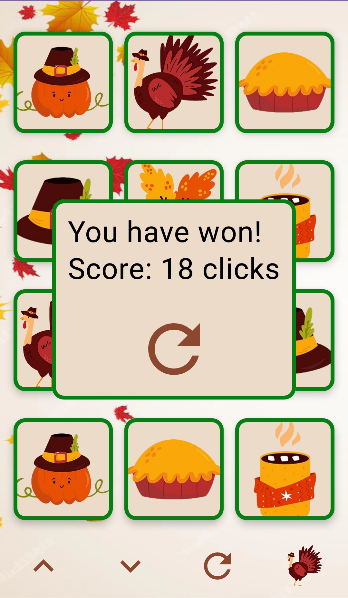

# MemoryGame
Android memory game with different holiday themes using Jetpack Compose

## A fun kotlin game to pass time

## Key Features

- **Jetpack Compose:** The app leverages *Jetpack Compose*, a modern Android UI toolkit, to create a seamless and interactive user experience.
- **Kotlin:** Developed entirely in *Kotlin*, the codebase benefits from the conciseness and expressiveness of the language, promoting efficient and readable code.

## Screenshots

